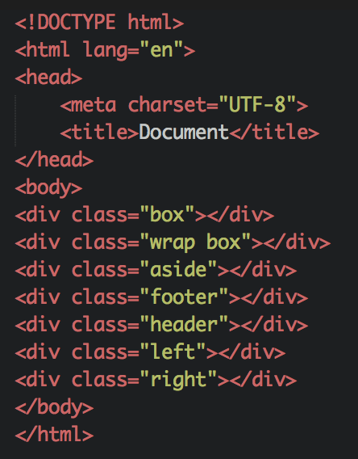
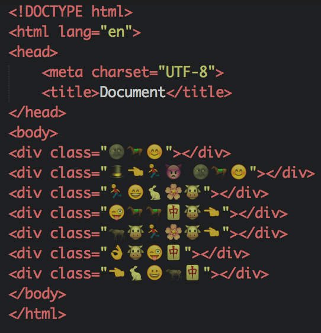

# gulp-html-class-emoji
一个gulp插件，将classname转为emoji

目前还只能转html, css

(ಥ_ಥ)在微博上看到的，感觉挺有意思，然后简单实现了下

## 使用
```
➜ npm install gulp-html-class-emoji --save-dev
```

gulpfile.js

```JavaScript
var gulp = require('gulp');
var emoji = require('gulp-html-class-emoji');


//less to css
gulp.task('run', function(){
	return gulp.src('./example/index.html')
		.pipe(emoji())
		.pipe(gulp.dest('dist/'))
})
```

## 效果


